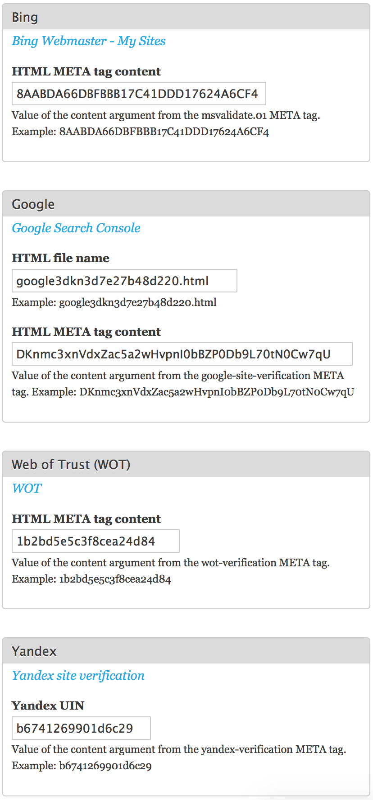

Site verification
=================

Verify ownership of your Backdrop website to search engine services.

Supported vendors are:

* [Google Search Console](https://www.google.com/webmasters/tools/dashboard)
* [Bing Webmaster Tools](https://www.bing.com/webmaster/home/mysites)
* [WOT](https://www.mywot.com)
* [Yandex](https://tech.yandex.com/webmaster/doc/dg/reference/hosts-type-docpage/)

Current Maintainer
------------------

- Seeking Maintainer

Credits
-----------

- Originally written for Backdrop by David Norman (https://github.com/deekayen)

License
-------

This project is GPL v2 software. See the LICENSE.txt file in this directory for
complete text.
